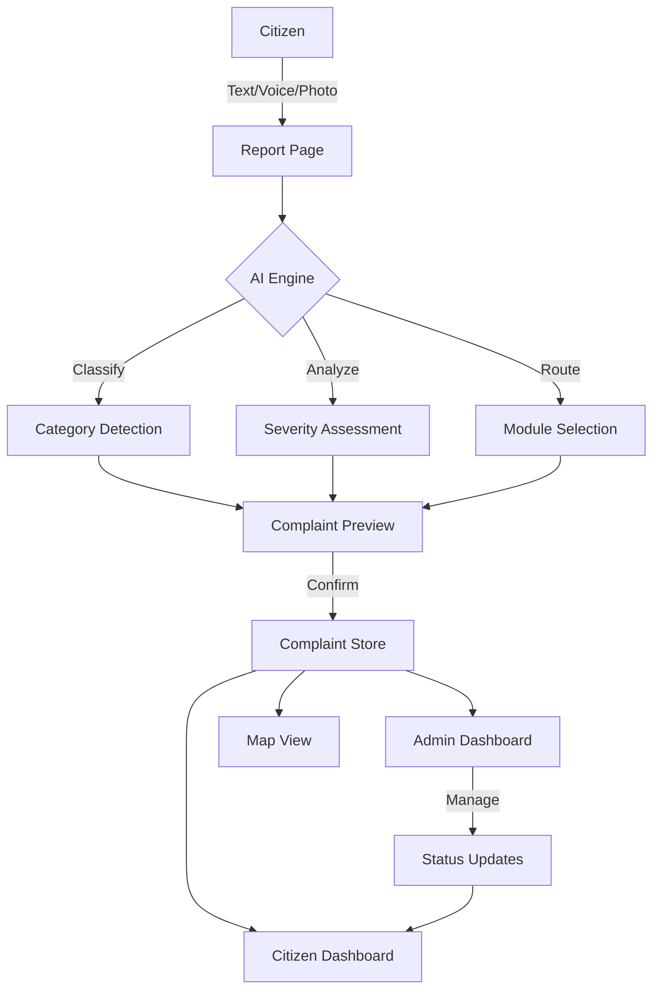

# 🏛️ REWA SAHAYAK AI

**"Problem batao. AI solution tak pahunchayega."**

> AI-powered civic problem reporting and assistance platform for Rewa & the Vindhya region.

Built for **iComputex Hackathon 2026 | Smart Rewa 2030** — Governance & Smart City Development track.

---

## 🎯 Problem Statement

Citizens in Rewa face numerous civic issues daily — garbage not collected, water leaks, potholes, broken streetlights. But reporting these problems is confusing:
- People don't know which department to contact
- Government categories are complicated
- Formal complaint writing is difficult
- No tracking mechanism exists

## 💡 Our Solution

**Rewa Sahayak AI** eliminates all complexity. A citizen simply:
1. **Types**, **speaks**, or **uploads a photo** of their problem
2. Our **AI understands** the problem in Hindi, English, or Hinglish
3. AI automatically **categorizes**, **assesses severity**, and **creates a structured complaint**
4. Complaint gets a **ticket number** for tracking
5. **Admin dashboard** manages, assigns, and resolves complaints
6. Citizens **track progress** on a live map

No complicated forms. No government jargon. Just describe the problem.

---

## ✨ Features

### Citizen Features
- 📝 **Text Input** — Type problem in any language
- 🎙️ **Voice Input** — Speak your problem using browser Speech Recognition
- 📷 **Photo Upload** — Upload images (JPG, PNG, WEBP)
- 📍 **Location Selection** — GPS or manual map selection
- 🤖 **AI Analysis** — Automatic category/severity/module detection
- 📋 **Complaint Preview** — Review AI-generated complaint before submission
- 🎫 **Ticket Tracking** — Track complaint with unique ticket number
- 📊 **Status Timeline** — Visual progress tracker

### AI Modules
- 🗑️ **Smart Waste** — Garbage, dumping, dirty areas, waste detection
- 💧 **JalRakshak** — Water leakage, waterlogging, drainage, supply issues
- 🏛️ **Rewa Sahayak** — Roads, potholes, streetlights, sanitation, general civic

### Admin Features
- 📊 **Dashboard** — Stats, charts, recent complaints
- 📋 **Complaint Management** — Filter, search, sort complaints
- ✏️ **Status Management** — Update status, assign departments, change priority
- 🗺️ **Map View** — Geographic complaint visualization with filters
- 📈 **Analytics** — Trends, resolution rates, AI insights
- 📝 **Internal Notes** — Add notes, resolution details

---

## 🏗️ Architecture



---

## 🛠️ Tech Stack

| Layer | Technology |
|-------|-----------|
| Frontend | React 19 + TypeScript |
| Build Tool | Vite 8 |
| Styling | Tailwind CSS 4 |
| Icons | Lucide React |
| Maps | Leaflet + OpenStreetMap |
| Charts | Recharts |
| Routing | React Router v7 |
| Voice | Web Speech API |
| Storage | localStorage (demo) |
| AI | Keyword-based NLP (demo mode) |

---

## 📁 Project Structure

```
rewa/
├── public/
│   └── favicon.svg
├── src/
│   ├── components/
│   │   ├── Layout.tsx          # App layout with navbar + footer
│   │   └── MapView.tsx         # Leaflet map component
│   ├── data/
│   │   └── demoData.ts         # 30 demo complaints, users, departments
│   ├── pages/
│   │   ├── Home.tsx            # Landing page
│   │   ├── Report.tsx          # Citizen reporting (text/voice/photo)
│   │   ├── Complaints.tsx      # Complaint listing with filters
│   │   ├── ComplaintDetail.tsx  # Single complaint view
│   │   ├── MapPage.tsx         # Map visualization
│   │   ├── About.tsx           # About & hackathon info
│   │   ├── Login.tsx           # Demo login
│   │   └── admin/
│   │       ├── Dashboard.tsx        # Admin dashboard
│   │       ├── AdminComplaints.tsx   # Admin complaint table
│   │       ├── AdminComplaintDetail.tsx # Admin complaint management
│   │       ├── AdminMap.tsx         # Admin map view
│   │       └── Analytics.tsx        # Analytics & insights
│   ├── services/
│   │   ├── ai.ts               # AI classification service
│   │   └── store.ts            # localStorage data store
│   ├── types/
│   │   └── index.ts            # TypeScript interfaces
│   ├── App.tsx                 # Router configuration
│   ├── main.tsx                # Entry point
│   └── index.css               # Design system
├── .env.example
├── index.html
├── package.json
├── tsconfig.json
├── vite.config.ts
└── README.md
```

---

## 🚀 Setup & Running

### Prerequisites
- Node.js 18+ installed
- npm or yarn

### Installation

```bash
# Clone / navigate to project
cd rewa

# Install dependencies
npm install

# Copy environment config
cp .env.example .env

# Start development server
npm run dev
```

The app will be available at **http://localhost:5173**

### Environment Variables

```env
# AI Service (optional — demo mode works without this)
VITE_GEMINI_API_KEY=

# Force demo mode
VITE_DEMO_MODE=true
```

---

## 🎮 Demo Mode

The application ships with **full demo mode**:
- **30 realistic complaints** covering waste, water, roads, streetlights, sanitation
- **5 demo citizens** and **1 admin user**
- **5 departments** mapped to modules
- **Realistic Rewa locations** with proper coordinates
- **Varied statuses** (Submitted → Under Review → Assigned → In Progress → Resolved → Closed)
- **No external APIs required** — works completely offline

### Demo Scenarios

**Scenario 1 — Waste Complaint:**
```
Input: "Hamare area mein 4 din se kachra nahi uthaya gaya"
→ Category: Waste Management
→ Module: Smart Waste
→ Severity: HIGH
```

**Scenario 2 — Water Issue:**
```
Input: "Pipeline leak ho rahi hai"
→ Category: Water & Leakage
→ Module: JalRakshak
→ Severity: HIGH
```

**Scenario 3 — Civic Issue:**
```
Input: "Gali ki street light kharab hai"
→ Category: Streetlights
→ Module: Rewa Sahayak
→ Severity: MEDIUM
```

---

## 📱 Routes

| Route | Description |
|-------|-------------|
| `/` | Landing page |
| `/report` | Citizen problem reporting |
| `/complaints` | Complaint listing |
| `/complaints/:id` | Complaint detail |
| `/map` | Map visualization |
| `/about` | About & hackathon info |
| `/login` | Demo login |
| `/admin` | Admin dashboard |
| `/admin/complaints` | Admin complaint management |
| `/admin/complaints/:id` | Admin complaint detail |
| `/admin/map` | Admin map view |
| `/admin/analytics` | Analytics & insights |

---

## 🗄️ Data Schema

### Complaint
```typescript
{
  id: string
  ticket_number: string        // REWA-2026-000001
  title: string
  description: string
  category: Category           // 9 categories
  subcategory: string
  module: Module               // smart_waste | jalrakshak | rewa_sahayak | other
  severity: Severity           // LOW | MEDIUM | HIGH
  status: ComplaintStatus      // 6 statuses
  citizen_id: string
  citizen_name: string
  created_at: string
  updated_at: string
  latitude: number | null
  longitude: number | null
  address: string
  image_url: string | null
  voice_transcript: string | null
  ai_summary: string
  ai_confidence: number
  assigned_department: string
  assigned_to: string
  resolution_note: string
  updates: ComplaintUpdate[]
}
```

---

## ⚠️ Disclaimer

This is a **hackathon prototype** built for demonstration purposes.

- ❌ **Not connected** to any official government systems
- ❌ **No real** complaint submission to authorities
- ❌ **No real** authentication — demo mode only
- ✅ All data stored locally in browser (localStorage)
- ✅ AI classifications are demo approximations
- ✅ Clearly labeled as prototype throughout UI

---

## 🔮 Future Roadmap

- [ ] Gemini AI API integration for smarter classification
- [ ] Supabase backend for persistent storage
- [ ] Real authentication (Supabase Auth)
- [ ] WhatsApp bot integration
- [ ] SMS notifications
- [ ] Image-based waste classification (Vision AI)
- [ ] Duplicate complaint detection
- [ ] Multilingual support (Bagheli)
- [ ] Offline-first PWA
- [ ] Government API integration
- [ ] Real-time notifications
- [ ] AI hotspot prediction

---

## 🏆 Hackathon

**iComputex Hackathon 2026 — Smart Rewa 2030**
- Track: Governance & Smart City Development
- Venue: Government Engineering College (GEC), Rewa
- Date: 30 October 2026

---

## 📄 License

Built for hackathon demonstration. Open for educational use.

---

<p align="center">
  <strong>REWA SAHAYAK AI</strong><br/>
  <em>"Problem batao. AI solution tak pahunchayega."</em>
</p>
